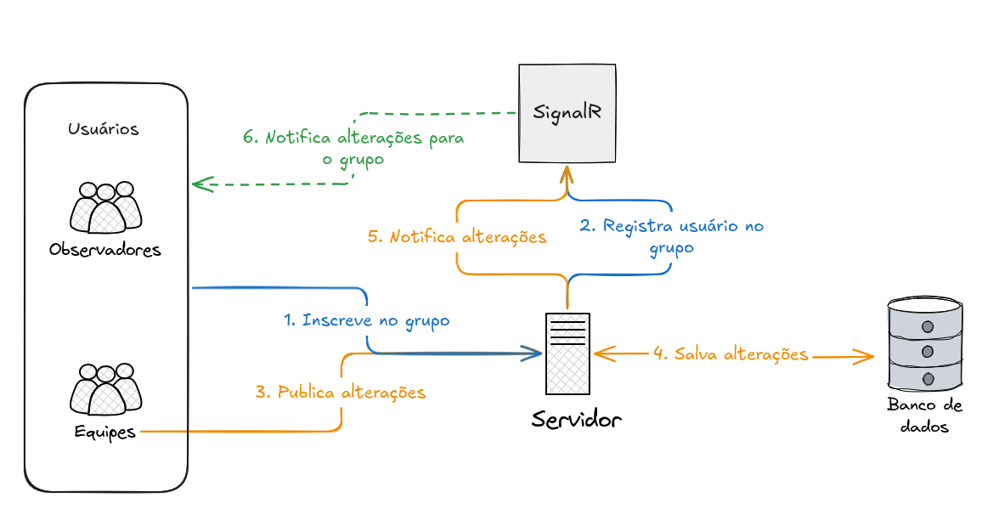

# Sobre

O projeto consiste em um orquestrador de serviços que são realizados por equipes de uma empresa. Roteiros são criados, e equipes podem assumiar vagas dos roteiros para começar a realizar serviços. A ideia é que qualquer um que esteja observando um roteiro veja as atualizações em tempo real. Equipes podem acabar ficando sem internet no meio dos serviços, e portanto, devem continuar realizando serviços sem a interrupção da rede; assim que a internet voltar, os serviços realizados são enviados ao servidor e o estado da roteirização é atualizado.

## Vagas

Uma equipe pode assumir qualquer vaga que esteja vazia em uma roteirização. Ela começará a atender os serviços de onde parou. Uma vez com a vaga ocupada, outro usuário só pode toma-lá assim que a vaga ficar vazia. Um usuário só pode rescindir uma vaga por decisão própria, isso quer dizer que, mesmo que sua internet caia, ele não irá perder a vaga. Isso acontece para evitar que duas equipes atendam o mesmo lugar, pode ser que a equipe apenas ficou sem internet por 10 minutos, mas continuou atendendo aos serviços.

## Características

- **Resiliência:** Uma equipe realizando serviços, pode ficar sem internet no meio do caminho. Quando isso acontece, os seus serviços realizados são armazenados localmente. E assim que retorna, são enviados para o servidor. Porém, quando está sem internet, apenas enxerga o último estado da roteirização recebido do servidor.

- **Comunicação em tempo real:** Qualquer pessoa conectada ao roteiro poderá ver em tempo real o status de cada vaga , quais serviços já foram realizados, e se as equipes estão online ou offline no presente momento.

## Tecnologias

- Para o frontend, utilizei `angular`;
- Para o backend, utilizei uma api REST em `C#`;
- Banco de dados relacional `postgresql` através do docker;
- Para comunicação em grupos, utilizei a biblioteca `SignalR` da microsoft. Essa biblioteca possui uma implementação no angular e no C#, que utilizei para fazer a comunicação. Ela é implementada através de web sockets por baixo dos panos;

## Arquitetura

Os usuários se inscrevem no grupo da roteirização através da rota `/hub/routing` no backend. Esse hub, que é gerenciado pela biblioteca `SignalR`, guarda os usuários que estão no grupo, e também mantém uma conexão ping-pong para identificar quando algum usuário cair. Se algum usuário cair, todo o restante do grupo recebe essa notificação, atualizando no front-end a lista de usuários onlines.

Quando um serviço é realizado, ou alguma ação acontece, essa ação é salva no banco, e então o `SignalR` notifica todas os usuário que estão no grupo sobre a atualização. O front-end recebe essa notificação e formata corretamente na tela.

Se alguma equipe ficar offline durante o processo, as outras equipes recebem a atualização na hora, e ainda mais, a equipe consegue continuar realizando serviços normalmente. Os serviços realizados ficam em uma fila, assim que a sua conexão retornar, os dados são enviados todos de uma vez para o servidor.

Como uma equipe não consegue tomar lugar da outra, essa operação é segura, pois não há risco de conflito, onde uma equipe enviou um serviço que a outra ainda estava fazendo.

## Execução

Para executar o projeto é necessário ter o dotnet sdk 8 instalado na máquina, node, e o docker para rodar o banco de dados. A partir da raiz, execute os comandos na seguinte sequencia:

1. `npm install`: instala dependencias do front-end;
1. `docker compose up -d`: inicia o banco de dados;
2. `cd apps/server && dotnet run`: inicia o servidor;
3. `npx nx serve client`: inicia o frontend na porta 4200;

## Vídeo

https://www.youtube.com/watch?v=h1HLXPA1CuE

## Autor
Eduardo Kurek | UTFPR-CM | 06/2026 

